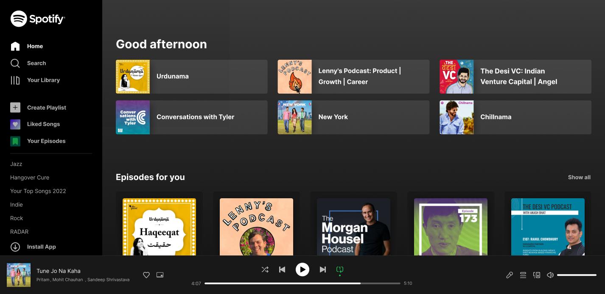

<h1>Spotify Interface Clone</h1>

> Status: finished ✔️

_Read this in othewr languages:_
[_Português_](.translations/README-ptBR.md)

## About the project

This project is a clone of the Spotify Web user interface, created for the purpose of practice and demonstration of frontend development skills, exclusively focuses on the visual aspects of the Spotify interface, excluding backend functionalities such as user management or music streaming.

## Photo used as a reference for building the interface.

## Technologies Used and Dependecies

<table>
  <tr>
    <td>Vite</td>
    <td>React</td>
    <td>Typescript</td>
    <td>Tailwind CSS</td>
  </tr>
  <tr>
    <td>^5.2.0</td>
    <td>^18.2.0</td>
    <td>^5.2.2</td>
    <td>^3.4.3</td>
  </tr>
</table>

## How to use

[Click Here](https://eriksgda.github.io/Spotify-Interface-clone/) to go to the website and see the project.

## License

This project is under [MIT](./LICENSE) license
